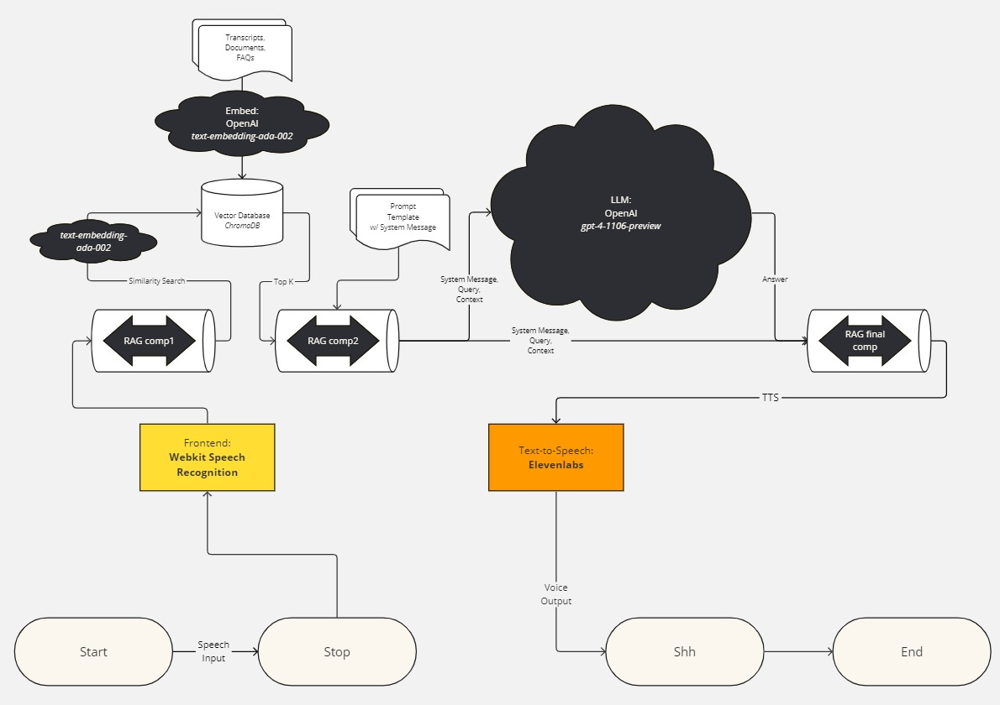

# Jarvis Demo

This is an ongoing Proof of Concept project to demonstrate the capabilities of our voice assistant, Jarvis, which is powered by OpenAI, ChromaDB, Langchain, ElevenLabs and FastAPI.

## Quick Start

```shell
$ export OPENAI_API_KEY=YOUR_API_KEY
$ export ELEVENLABS_API_KEY=YOUR_API_KEY
$ pip install -r requirements.txt
$ python3 app.py
```



## How it works

Our current implementation allows you to record your voice with a button to start and stop recording. Then by asking questions, Jarvis will answer them in a natural sounding voice. There is a stop button to interrupt the answer if it's too long.

## Features

The application uses the GPT-4 Turbo API as an LLM. Note, LLMs are not always correct, but with the help of ChromaDB and Langchain, we use Retrieval Augmented Generation to generate answers that are usually correct and more relevant to the question.

Additionally, we use the ElevenLabs API to generate more natural sounding human voice responses.

The speech recognition is done in the Web Browser with the SpeechRecognition API. The text is sent to the backend endpoint (FastAPI) and then the response is sent back to the frontend and played in the browser.

## Alternative Implementation

It is also possible to detect a wakeup keyphrase, such as "Hey, Jarvis!" and then listen to a voice command. Speech recognition is done with OpenAI Whisper, locally. The command is then sent to the ChatGPT API and the response is spoken via the OpenAI Text-to-Speech API.

You need to initialize it with the `init.py` script by saying the keyphrase you want to wake up the device with 10 times. After that you can run `recognize.py` and it will recognize when you say the keyphrase and then listen for the command.